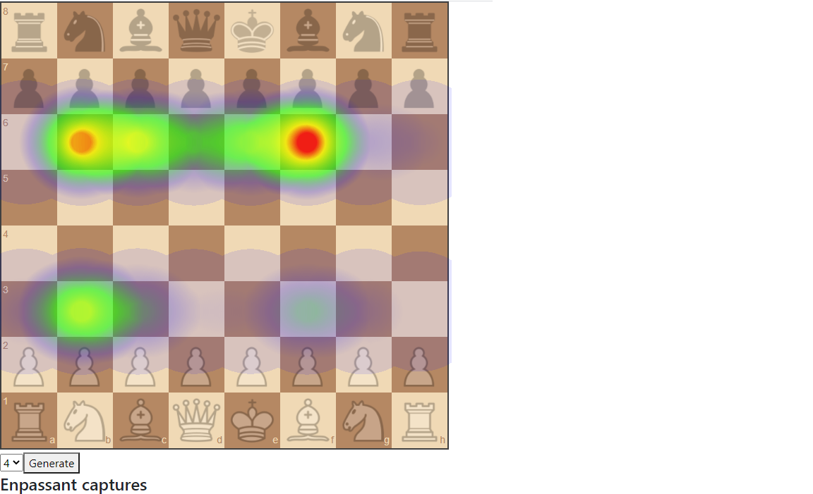

## Table of contents
* [General info](#general-info)
* [Installation](#installation)
* [Technologies](#technologies)
* [Screenshots](#screenshots)

## General info
Web based visualisation app which generates chess heatmaps.
Data is gathered from around 13k games and around 1M positions, every heatmap visualizes the location of pieces or the location of certain game events.

## Installation
install front-end depenencies
```
npm install
```
run local server
```
ng serve
```

## Technologies
Project is created using:
* Angular 11
* heatmap.js - https://www.patrick-wied.at/static/heatmapjs/
* chessboardjs - https://chessboardjs.com/

## Screenshots
**Most popular first moves from the white side**

**Most popular first moves from the black side**

**Last move king position from the both sides**

**En passant captures from the both sides**

**All pieces capture location from the both sides**

